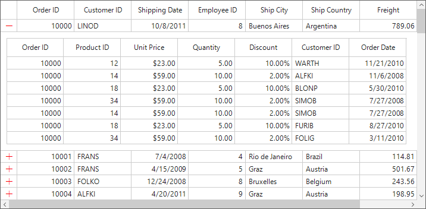

# How to Change the Expander Icon Color of the Master-Details View in WinForms DataGrid?

## About the sample

The `SfDataGrid` provides support to represent the hierarchical data in the form of nested tables by using Master-Details view. You can expand or collapse the nested table (DetailsViewDataGrid) by using an expander column in a row. You can also expand or collapse the nested table programmatically. The number of tables nested with relations are unlimited.

This sample illustrates how to change the expander icon color of this Master-Details View in [WinForms DataGrid](https://www.syncfusion.com/winforms-ui-controls/datagrid) (SfDataGrid).

In `DataGrid`, You can change the color of the expander icon of the master details view as given below.  

``` c#
typeof(DataGridStyle).GetProperty("DetailsViewExpanderColor", System.Reflection.BindingFlags.NonPublic | System.Reflection.BindingFlags.Instance).SetValue(this.sfDataGrid1.Style, Color.Red);
```


Take a moment to peruse the [WinForms DataGrid - Master Details View](https://help.syncfusion.com/windowsforms/datagrid/masterdetailsview), where you can find about Master Details view, with code examples.

## Requirements to run the demo
Visual Studio 2015 and above versions.